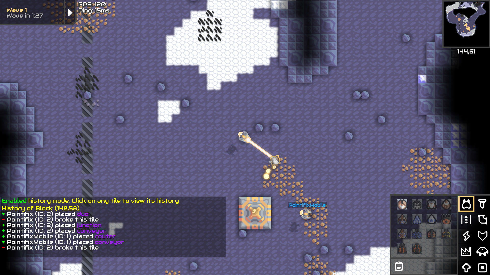

# History Plugin

Saves the history of each tile and lets you display it later.

## How to use

Simply copy both files ``HistoryPlugin.jar`` and ``history-config.json`` into your ``<server-folder>/config/mods`` directory

In ``history-config.json`` you can change whether or not only admins can lookup a tiles history and how many history entries each tile should save at max.
